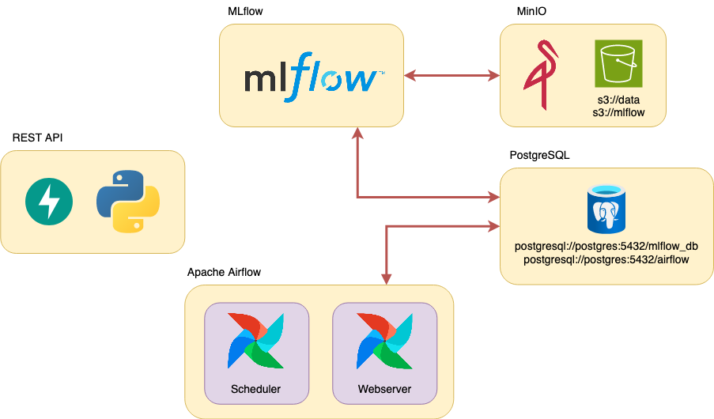

# Propinas de taxis de NYC en producción
### MLOps1 - CEIA - FIUBA

TP final de Operaciones de Aprendizaje Automático I. Llevamos al ambiente productivo de **ML Models and something more Inc.** el modelo que armamos en Aprendizaje de Máquina I: una regresión que estima la propina (`tip_amount`) de viajes de Yellow Taxi pagados con tarjeta.

- Repo de AMq1: https://github.com/fedlerner/CEIA-AdM-TP-Yellow_Taxi_NYC
- Datos: [TLC Trip Record Data](https://www.nyc.gov/site/tlc/about/tlc-trip-record-data.page), un archivo parquet por mes.
- Modelo: `HistGradientBoostingRegressor` con pérdida absoluta, ajustado con Optuna.

## Qué hace

1. **ETL (Airflow):** baja un mes de la TLC, lo limpia con las mismas reglas de AMq1, toma una muestra y guarda train/test en `s3://data/taxi/`. Por ahora, el archivo fuente hay que subirlo a mano a s3://data/raw/.
2. **Experimento (notebook + MLflow):** búsqueda de hiperparámetros con Optuna, cada trial como run anidado. El mejor pipeline se registra como `taxi_tip_model` con alias `champion`. *(pendiente)*
3. **Predicción en lote (Airflow):** toma un mes nuevo, predice con el `champion` y guarda los resultados en la tabla `predicciones_propina` de la base `taxi` en Postgres. Como la propina real también viene en los datos, registra el MAE del mes en MLflow. *(pendiente)*

El preprocesamiento va dentro de un `Pipeline` de sklearn, así entrenamiento y predicción usan exactamente lo mismo.

## Servicios

Todo corre con Docker Compose:

| Servicio | URL | Usuario / clave |
|---|---|---|
| Airflow | http://localhost:8080 | airflow / airflow |
| MLflow | http://localhost:5001 | - |
| MinIO | http://localhost:9001 | minio / minio123 |
| API (FastAPI) | http://localhost:8800 | - |
| Postgres | localhost:5432 | airflow / airflow |

Buckets: `s3://data` (nuestros datos) y `s3://mlflow` (artefactos de MLflow).
Bases en Postgres: `airflow`, `mlflow_db` y `taxi` (predicciones).



## Cómo levantarlo

Necesitás Docker con al menos 4 GB de RAM (mejor 6 GB o más).

1. Crear las carpetas de Airflow si no existen:
   ```bash
   mkdir -p airflow/{config,dags,logs,plugins}
   ```
2. En `.env`, poner en `AIRFLOW_UID` el resultado de `id -u` (Linux/macOS).
3. Levantar todo:
   ```bash
   docker compose --profile all up --build
   ```
4. Revisar con `docker ps -a` que los servicios estén *healthy*.

La base `taxi` se crea solo la primera vez que arranca Postgres. Si ya tenías el volumen de antes, hay que borrarlo una vez:

```bash
docker compose down --volumes
```

Para apagar: `docker compose --profile all down`. Para borrar todo (imágenes, buckets y bases): `docker compose down --rmi all --volumes`.

## Configuración

- Variables de Airflow en `airflow/secrets/variables.yaml`: `taxi_sample_size` (filas de la muestra), `taxi_test_size` y `taxi_random_state`.
- Conexión `taxi_db` en `airflow/secrets/connections.yaml`, usada por el DAG de predicción en lote.
- MLflow está fijado en 3.1.4 y scikit-learn en 1.4.2 (la versión de AMq1), para que cliente, servidor y modelo coincidan.
- MinIO usa las imágenes de Chainguard (`cgr.dev/chainguard/minio`), porque las oficiales de MinIO dejaron de ser públicas.

Para usar MinIO y MLflow desde una notebook en tu máquina:

```bash
export AWS_ACCESS_KEY_ID=minio
export AWS_SECRET_ACCESS_KEY=minio123
export AWS_ENDPOINT_URL_S3=http://localhost:9000
export MLFLOW_S3_ENDPOINT_URL=http://localhost:9000
```

y `mlflow.set_tracking_uri("http://localhost:5001")`. Dentro de los contenedores las direcciones son `http://mlflow:5000` y `http://s3:9000`.

## Estado

- [x] Ambiente ajustado (versiones, base `taxi`, variables)
- [x] ETL
- [ ] Experimento y registro del modelo
- [ ] Predicción en lote
