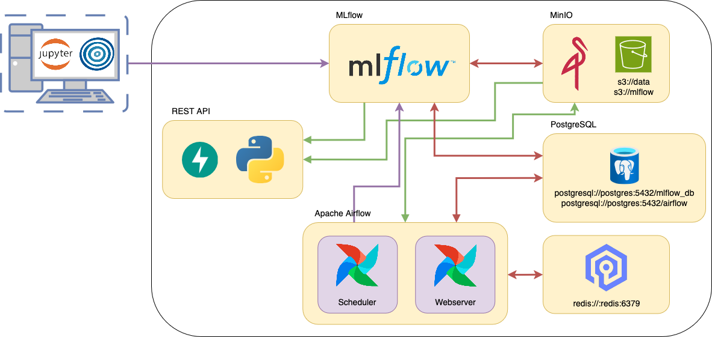

# Ejemplo de Implementación de un Modelo de Heart Disease 
### AMq2 - CEIA - FIUBA

En este ejemplo, mostramos una implementación de un modelo productivo para detectar si un 
paciente tiene una enfermedad cardiaca o no, utilizando el servicio de 
**ML Models and something more Inc.**. Para ello, obtenemos los datos de 
[Heart Disease - UCI Machine Learning Repository](https://archive.ics.uci.edu/dataset/45/heart+disease).

La implementación incluye:

- En Apache Airflow, un DAG que obtiene los datos del repositorio, realiza limpieza y 
feature engineering, y guarda en el bucket `s3://data` los datos separados para entrenamiento 
y pruebas. MLflow hace seguimiento de este procesamiento.
- Una notebook para ejecutar localmente con Optuna, que realiza una búsqueda de 
hiperparámetros y encuentra el mejor modelo utilizando F1-score. Todo el experimento se 
registra en MLflow, se generan gráficos de importancia de características, y además, se 
registra el modelo en el registro de modelos de MLflow.
- Un servicio de API del modelo, que toma el artefacto de MLflow y lo expone para realizar 
predicciones.
- En Apache Airflow, un DAG que, dado un nuevo conjunto de datos, reentrena el modelo. Se 
compara este modelo con el mejor modelo (llamado `champion`), y si es mejor, se reemplaza. Todo 
se lleva a cabo siendo registrado en MLflow.



Las flechas verdes y violetas representan nuevas conexiones en comparación con el proyecto base.

## Testeo de Funcionamiento

El orden para probar el funcionamiento completo es el siguiente:

1. Tan pronto como se levante el sistema multi-contenedor, ejecuta en Airflow el DAG 
llamado `process_etl_heart_data`, de esta manera se crearán los datos en el 
bucket `s3://data`.
2. Ejecuta la notebook (ubicada en `notebook_example`) para realizar la búsqueda de 
hiperparámetros y entrenar el mejor modelo.
3. Utiliza el servicio de API.

Además, una vez entrenado el modelo, puedes ejecutar el DAG `retrain_the_model` para probar 
un nuevo modelo que compita con el campeón. Antes de hacer esto, ejecuta el DAG 
`process_etl_heart_data` para que el conjunto de datos sea nuevo, de lo contrario se entrenará 
el mismo modelo. Este proceso siempre dará como resultado que el modelo inicial es mejor... 
el motivo de esto se deja al lector para que comprenda lo que está sucediendo.

### API 

Podemos realizar predicciones utilizando la API, accediendo a `http://localhost:8800/`.

Para hacer una predicción, debemos enviar una solicitud al endpoint `Predict` con un 
cuerpo de tipo JSON que contenga un campo de características (`features`) con cada 
entrada para el modelo.

Un ejemplo utilizando `curl` sería:

```bash
curl -X 'POST' \
  'http://localhost:8800/predict/' \
  -H 'accept: application/json' \
  -H 'Content-Type: application/json' \
  -d '{
  "features": {
    "age": 67,
    "ca": 3,
    "chol": 286,
    "cp": 4,
    "exang": 1,
    "fbs": 0,
    "oldpeak": 1.5,
    "restecg": 2,
    "sex": 1,
    "slope": 2,
    "thal": 3,
    "thalach": 108,
    "trestbps": 160
  }
}'
```

La respuesta del modelo será un valor booleano y un mensaje en forma de cadena de texto que 
indicará si el paciente tiene o no una enfermedad cardiaca.

```json
{
  "int_output": true,
  "str_output": "Heart disease detected"
}
```

Para obtener más detalles sobre la API, ingresa a `http://localhost:8800/docs`.

Nota: Recuerda que si esto se ejecuta en un servidor diferente a tu computadora, debes reemplazar 
`localhost` por la IP correspondiente o el dominio DNS, si corresponde.

Nota: Recordar que si esto se ejecuta en un servidor aparte de tu computadora, reemplazar a 
localhost por la IP correspondiente o DNS domain si corresponde.

La forma en que se implementó tiene la desventaja de que solo se puede hacer una predicción a 
la vez, pero tiene la ventaja de que FastAPI y Pydantic nos permiten tener un fuerte control 
sobre los datos sin necesidad de agregar una línea de código adicional. FastAPI maneja toda 
la validación.

Otra forma más típica es pasar los features como una lista u otro formato similar con 
N observaciones y M features, lo que permite realizar varias predicciones al mismo tiempo. 
Sin embargo, se pierde la validación automática.

## Nota Final

Si desean utilizar este proyecto como base para su propia implementación, es válido. 
Además, podrían agregar un frontend que se comunique con la API para mejorar la experiencia 
de usuario.

También, si desean mejorar este ejemplo, ¡los Pull Requests son bienvenidos!
